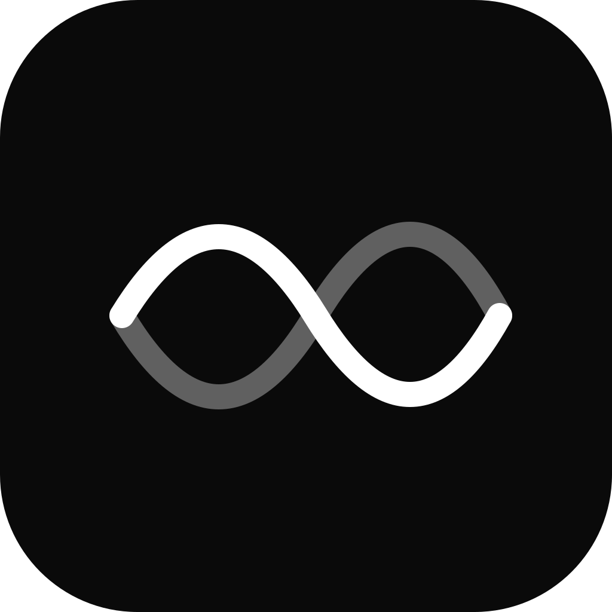

<div align="center">
  
  <h1>Foolscap</h1>
  <p><strong>The keyboard-first scratchpad with superpowers.</strong></p>
  <p>
    Hit one hotkey, dump a thought, compute something, start a timer, and move on.
    Notes auto-rotate. Math is inline. The desktop blurs through the window.
  </p>
  <p>
    <a href="https://github.com/Romain-Boudot/foolscap/releases/latest">Download</a>
    ·
    <a href="https://foolscap.app">Website</a>
    ·
    <a href="CLAUDE.md">Project notes</a>
  </p>
</div>

---

Foolscap is what a sticky note looks like once you give it a math engine, a few
timers, a clipboard daemon, and an `Alt + A` to summon it from anywhere. Built
for the moments your text editor is too much and a Post-it is too little.

Not Notion. Not Obsidian. Not Evernote. **No knowledge base.** Notes you don't
touch for a week disappear at the next launch.

## Four pillars

- **Inline math & money.** Named variables, reactive recalc, units
  (`5 km in mi`), 30+ currencies refreshed from the ECB, aggregates over
  labelled ranges (`sum(*_revenue)`).
- **Programmable timers.** `timer 25m: focus`, `every 1h x 8: water`,
  `at 14:30: standup`, `pomodoro 25/5 x 4`. Survive restart, fire a chime &
  toast, run while the window is hidden.
- **AutoPaste mode.** Toggle once, anything you copy from anywhere lands in
  the current note. Recording-dot indicator while it's on.
- **Ephemeral by default.** Pin what matters. The palette warns you before
  the rest goes.

## Install

**Windows 10/11 · x64** — grab the `.msi` from
[the latest release](https://github.com/Romain-Boudot/foolscap/releases/latest).
Unsigned for now; SmartScreen will ask "More info → Run anyway".

**macOS** — coming soon.

## Run from source

```sh
git clone https://github.com/Romain-Boudot/foolscap
cd foolscap
npm install
npm run tauri dev
```

You'll need [Rust](https://rustup.rs) and the
[Tauri 2 prerequisites](https://v2.tauri.app/start/prerequisites/) for your
platform (WebView2 on Windows, Xcode CLT on macOS).

```sh
npm run tauri build   # produce platform installers in src-tauri/target/release/bundle
npm test              # vitest — math evaluator, parsers, paste transforms
```

## Stack

Tauri 2 · Rust · Vue 3 · TypeScript · Vite · CodeMirror 6 · mathjs · SQLite.
~5 MB installer, no Electron, no Node runtime shipped.

See [CLAUDE.md](CLAUDE.md) for the architectural decisions, data model, and
roadmap.

## License

[PolyForm Noncommercial 1.0.0](https://polyformproject.org/licenses/noncommercial/1.0.0/) —
source-available, free for personal & noncommercial use. © Romain Boudot.
